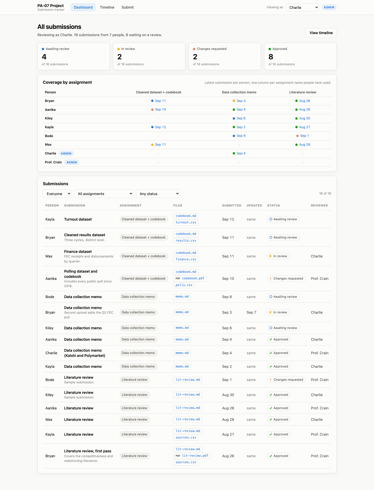
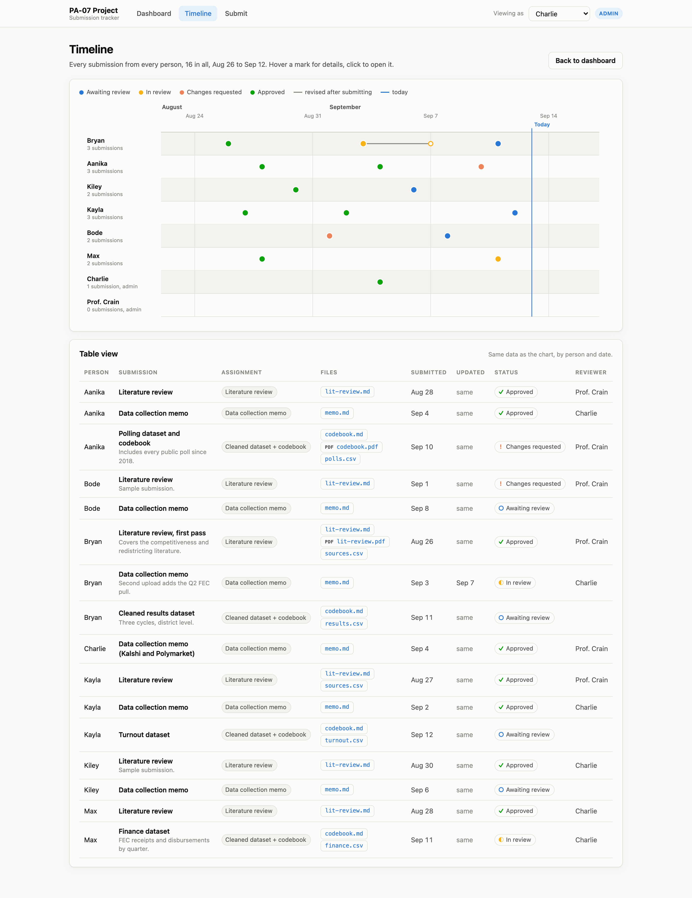
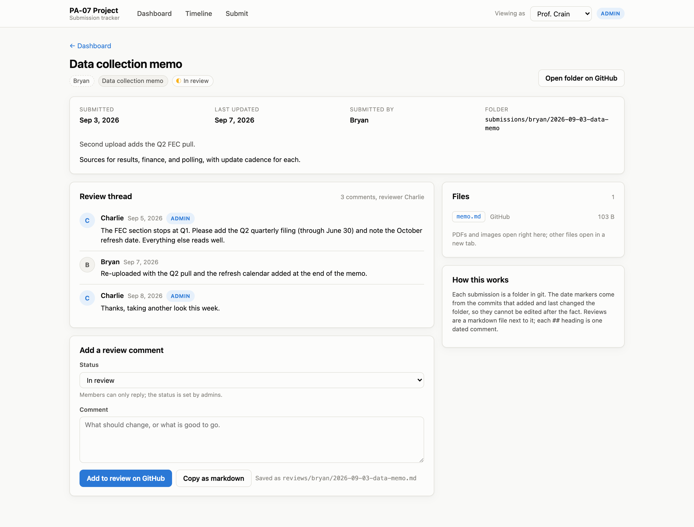
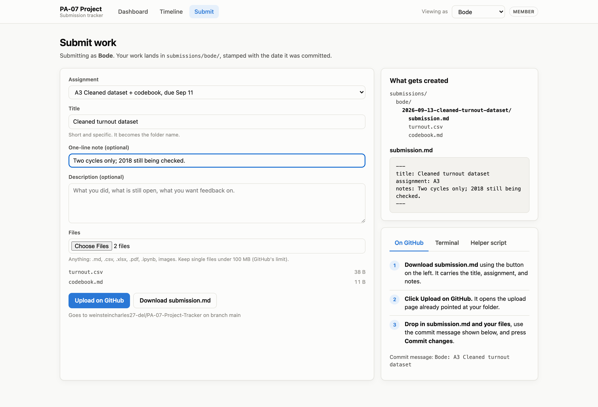

# PA-07 Project Tracker

A submission and review tracker that runs on git. Members submit work by
committing a folder. Admins review by committing a markdown file next to it.
A small static site reads the repo and shows a dashboard, a per-person
timeline, and a review thread for every submission. Dates come from git, so
they cannot be edited after the fact.

**Members:** Bryan, Aanika, Kiley, Kayla, Bode, Max, Charlie, Prof. Crain
**Admins (see and review everything):** Charlie, Prof. Crain

Mockups of every page are in [`mockups/`](mockups/), rendered with sample data:

| | |
|---|---|
|  |  |
| Admin dashboard: everyone's work, coverage by assignment | Timeline: one lane per person, due dates and revisions |
|  |  |
| A submission with its review thread | The submit form and what it creates |

## How submitting works

Every submission is one folder:

```
submissions/<your-id>/<YYYY-MM-DD>-<short-title>/
    submission.md      title, assignment, a note for the reviewer
    ...your files      anything: .md, .csv, .xlsx, .pdf, .ipynb, images
```

`submission.md` looks like this:

```markdown
---
title: Data collection memo
assignment: A2
notes: Second upload adds the Q2 FEC pull.
---
Optional longer description, in markdown.
```

Three ways to get it into the repo. Pick whichever you are comfortable with.

1. **On GitHub, no git needed.** Open the site's Submit page, fill in the
   form, download the generated `submission.md`, then press *Upload on
   GitHub*. It opens GitHub's upload page pointed at your folder; drop in
   `submission.md` and your files and commit.
2. **Terminal.** Make the folder, save `submission.md` and your files in it,
   then `git add`, `git commit`, `git push`. The Submit page prints the exact
   commands.
3. **Helper script.** From the repo root:
   ```bash
   python3 scripts/submit.py --as bryan --assignment A2 --title "Data collection memo" memo.md --push
   ```

To revise a submission, change the files in the same folder and commit again.
The tracker shows both the original date and the latest revision date.
Renaming a submission folder resets its dates and detaches its review, since
the folder name is how the tracker identifies it, so revise in place instead.

Your member id is your first name in lowercase (`bryan`, `aanika`, `kiley`,
`kayla`, `bode`, `max`, `charlie`) or `prof-crain`. The full list is in
[`members.json`](members.json); assignments and due dates are in
[`assignments.json`](assignments.json).

## How reviewing works

Admins review by writing one file per submission:

```
reviews/<member-id>/<submission-folder-name>.md
```

```markdown
---
status: changes-requested
reviewer: Prof. Crain
---

## 2026-09-05 Charlie

The FEC section stops at Q1. Please add the Q2 quarterly filing.

## 2026-09-07 Bryan

Re-uploaded with the Q2 pull.
```

`status` is one of `submitted`, `in-review`, `changes-requested`, or
`approved`. Each `## <date> <name>` heading is one comment in the thread.
Anyone can add a comment; only admins change the status. The submission page
on the site drafts this file for you and opens GitHub's editor with it filled
in, so a review is one click plus a commit.

## Running the site

The site is plain HTML and reads `site/data/index.json`, which
`scripts/build.py` generates from the repo. No dependencies beyond Python 3.

```bash
python3 scripts/build.py
python3 -m http.server 8000 -d site
```

Then open <http://localhost:8000/>. Pick who you are from *Viewing as* in the
top bar. Members see only their own work; admins see everyone's.

A GitHub Actions workflow rebuilds `index.json` on every push, so the checked
in data file is always current. To publish the site with GitHub Pages
(Settings, Pages, deploy from Actions), note that Pages on a **private** repo
needs a paid GitHub plan; on the free plan the site runs locally as above, or
the repo has to be public.

## Who can see what

The visibility rule (members see their own work, admins see everything) is
applied by the site. It is not enforced by the repo: anyone with read access
to a git repository can read every file in it, and GitHub has no per-folder
read permissions. Two practical setups:

- **Trust the group.** Keep one private repo, add everyone as a collaborator,
  and rely on the site's role views. Simplest, and fine if members seeing
  each other's folders on GitHub is acceptable.
- **Enforce it.** Give each member their own private repo (or fork) that only
  they and the admins can read, and have the admins' copy of this repo pull
  those in as submodules or with a sync script. More setup, real isolation.

Either way, a CODEOWNERS file can require an admin's approval before anything
under `reviews/` is merged, and branch protection can require pull requests
so nobody rewrites history.

## Layout

```
members.json          roster, roles, and the GitHub repo the site links to
assignments.json      assignment ids, titles, due dates
submissions/<id>/     one folder per submission (members write here)
reviews/<id>/         one markdown file per submission (admins write here)
site/                 the static site; data/index.json is generated
scripts/build.py      repo -> site/data/index.json
scripts/submit.py     helper that creates, commits, and pushes a submission
scripts/mockup.py     renders the site with sample data and screenshots it (Playwright)
fixtures/             sample submissions and reviews used only for the mockups
mockups/              the screenshots
```

To regenerate the mockups after changing the site:

```bash
python3 scripts/build.py --root fixtures --out site/data/sample-index.json
python3 scripts/mockup.py
```
